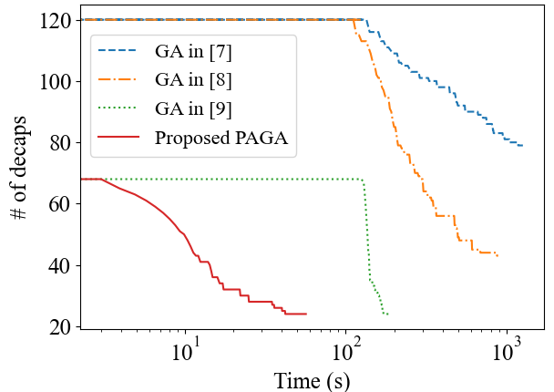
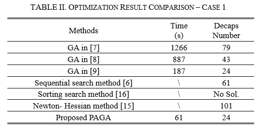
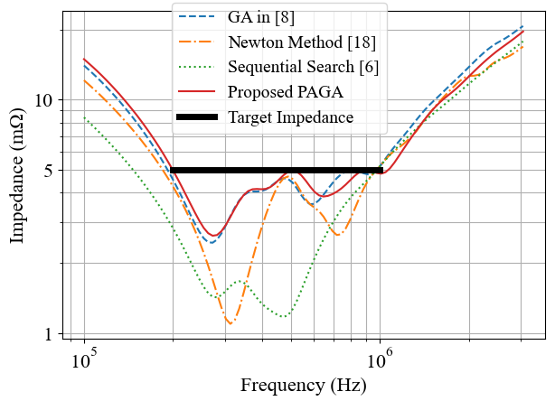
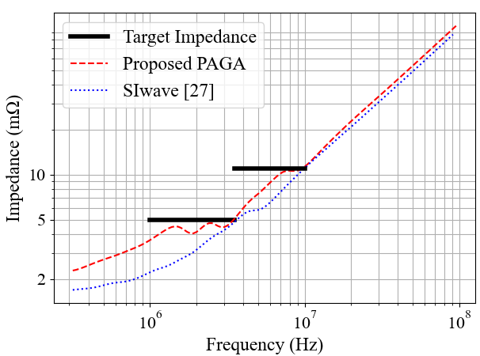
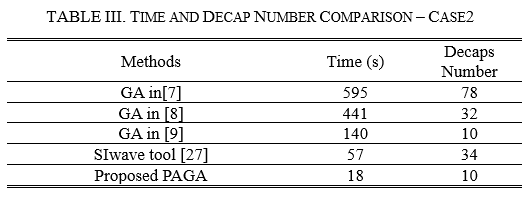
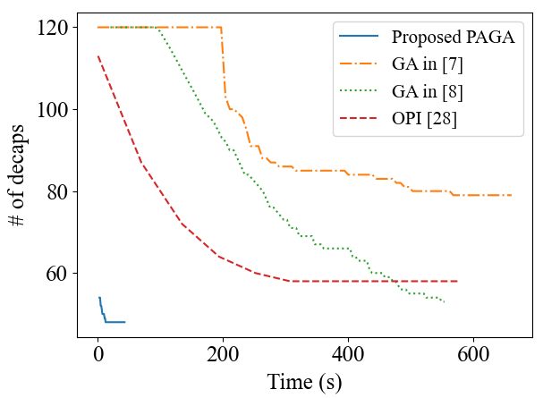
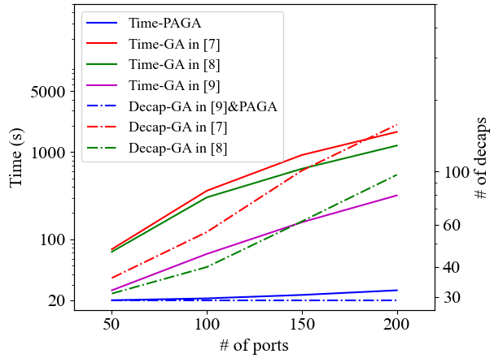

# Introduction

This repository includes the source code of the paper **“A Novel Physics-Assisted Genetic Algorithm (PAGA) for Decoupling Capacitor Optimization”** (to be published in IEEE journal). 

A physics-assisted genetic algorithm is used to optimize the locations and types of decoupling capacitors in power distribution network.

Some conventional methods are also reproduced with some slight modifications while maintaining their core concepts. These modified methods are also included in this project. 

For more details of the algorithm, please refer to the paper **"A Novel Physics-Assisted Genetic Algorithm (PAGA) for Decoupling Capacitor Optimization"** (to be published in IEEE journal). 

# File Structure
root directory 
--PAGA : the main code of this project. 
--ModifiedGA: the source code of the "Modified-GA Method" 
--NewtonMethod: the source code of the "Newton-Hession Method" 
--SequentialSearch: the source code of the "Sequential Search Method" 
--OringinalGA: the source code of the "Original GA Method" 
	

	

For the details of the remaining methods, please refer to the following papers: 
**J. Juang, et al., “A Modified Genetic Algorithm for the Selection of Decoupling Capacitors in PDN Design,” Proc. Int. Symp. IEEE Electromagn. Compat., pp. 712-717, 2021.** 
**J. Wang, Z. Xu, X. Chu, J. Lu, B. Ravelo, and J. Fan, “Multiport PDN optimization with the Newton–Hessian minimization method,” IEEE Trans. Microw. Theory Techn., vol. 69, no. 4, pp. 2098–2109, Apr. 2021.** 
**F. de Paulis, et al., “Genetic Algorithm PDN Optimization based on Minimum Number of Decoupling Capacitors Applied to Arbitrary Target Impedance,” Proc. IEEE Int. Symp. Electromagn. Compat. Signal/Power Integrity (EMCSI), pp. 428-433, 2020.** 
**Z. Xu, Z. Wang, Y. Sun, C. Hwang, H. Delingette, and J. Fan, “Jitter-aware economic PDN optimization with a genetic algorithm,” IEEE Trans. Microw. Theory Techn., vol. 69, no. 8, pp. 3715–3725, Aug. 2021.** 
		
# Usage
Dependencies：this project depends on some python packages including numpy, matplotlib, scikit-rf and so on. 

To run the given demos, simply run "python3 main.py" in each algorithm directory. 

The three example cases in the paper are included in the \PAGA folder, to change between the three cases, simply change the code in the "read S parameter or Z parameter" section.
Note that case1 and case2 have no size constraint, so the "size constraint" scetion need to be modified accordingly. (comment/uncomment the line 378/379) 

To perform the PAGA in your own PDN, a Z-parameter matrix needs to be provided through a .SNP file or .npy file. Note that the default IC port is the first port of the given file.	After the algorithm is finished, the solution is saved in the variable "model.best_variables", the meaning of this variable is illustrated in section II of the paper.

# performance
comvergence process of case1 (120 ports in total)

comparison of different method (case1)

impedance curves of case1

impedance curves of case2

comparison of different method (case2)

comvergence process of case3 (120 ports in total)

robustness validation (when number of ports increse)

# Maintainers
This project is owned and managed by Li jiang and Ling Zhang from Zhejiang University, China. 

# Acknowledgements
The basic framework of the genetic algorithm is based on the project available at https://github.com/rmsolgi/geneticalgorithm.
	
# License
copyright 2023 Li Jiang

